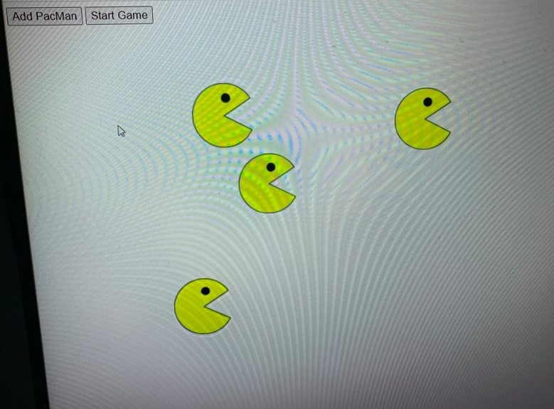

# PacMen-Exercise
PacMen Exercise: Moving Pacmen in the screen

**Project Title:** Pacmen Move

 

 
<a href="https://keoyoulong.github.io/">Link To Home Page</a>
 

When clicking the AddPacman Button , the pacman created. You can create many pacman you want. Later, click Startgame. The created Pacman will move all over the screen.

To Run the project, have to download or close all files in the repository to your local machine in the same directory. Then run the index.html file on your broswer. Finally click the the button metioned above.

For future improvement, i would have the Pacman run up and down and stop and then multiply themselves and continue again.

License Information: should refer to MIT license file.
